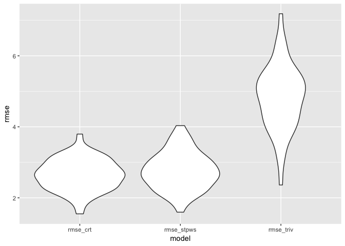

Exploring Gun Violence Trends in the United States
================
Yuelin Long (yl3181), Marisa Sobel (ms5533), Eileen Shea (eas2297), Zanis Fang (zf2213), Devon Morgan (dm3175)
12/3/2018

Motivation
----------

Gun violence has been of increasing concern across the United States over the past decade. Our objective was to develop an online resource to explore general trends in gun violence and identify any important variables associated with gun violence incidence. The target audience for this webpage includes the general public, gun violence activists and legislators. The goal of this resource is to raise awareness on the widespread impact of gun violence, and inform future public health interventions and policy changes.

Background
----------

-   The [American Public Health Association (APHA)](https://www.apha.org/topics-and-issues/gun-violence) states that gun violence "is a leading cause of premature death in the U.S." More than 38,000 individuals are killed by guns each year, and another 85,000 are injured.
-   Already in 2018, the [Gun Violence Archive](https://www.gunviolencearchive.org) has reported 52,422 gun violence incidents in the United States; 325 of these incidents were mass shootings.
-   Since 1996, the [Dickey Amendment](https://en.wikipedia.org/wiki/Dickey_Amendment) has acted as a de facto ban on gun violence research by the [Centers for Disease Control and Prevention (CDC)](https://www.cdc.gov).

Related Work
------------

Gun violence has received widespread media attention in recent years, particularly due to the increased occurrence of mass shootings. Preventing firearm injury and death has increasingly been considered a major public health issue.

Inspiration was drawn from a variety of background sources including:

-   [Gun Violence Archive](https://www.gunviolencearchive.org/), a nonprofit focused on providing data on gun related incidents in the U.S., which provides helpful visuals related to gun violence incidents across the country.
-   [Wintemute, G. J. (2015). The epidemiology of firearm violence in the twenty-first century United States. Annual Review of Public Health, 36, 5-19.](https://www.annualreviews.org/doi/full/10.1146/annurev-publhealth-031914-122535)
-   [Gun Violence - National Institute for Justice](https://www.nij.gov/topics/crime/gun-violence/pages/welcome.aspx)
-   [Giffords Law Center](https://lawcenter.giffords.org)

The Data Science methods used for this project draw from topics covered throughout P8105. In particular, inspiration on some of the map visualizations was drawn from the in-class visualizations on the Airbnb dataset. Further, as a team comprised of biostatisticians, epidemiologists and environmental health scientists in training, we successfully drew from different areas of expertise to inform the direction of the project.

Initial Questions
-----------------

Questions to address in the project include:

-   How do rates of gun violence differ across states? Which areas have the highest concentrations of gun violence?
-   How have gun violence rates changed over time?
-   Which age groups and races are most impacted by gun violence mortality, and has this changed over time?
-   How does gun law strength relate to firearm mortality? How do gun law strengths differ across the U.S.?
-   How are unemployment rates related to firearm mortality?
-   How are gun license approval rates related to firearm mortality and law strength?
-   How does the gun application percentage(proportion of people applying for the license in total population) relate to firearm mortality and law strength?

Data Sources and Cleaning Methods
---------------------------------

Data from six sources were considered for this project. The data sources, scraping methods and cleaning procedures for each dataset are described below.

-   The Github repository for this project can be found [here](https://github.com/ChristineLong/p8105_Final_Project).

-   The final website can be found [here](https://mhsobel.github.io/p8105_Final.github.io/), and corresponding Github repository for the website is located [here](https://github.com/mhsobel/p8105_Final.github.io).

-   The final report is housed in a repository [here](https://github.com/devon-m2/p8105_Gun-Violence_Final-Report).

### Data Download

All datasets can be downloaded from the following Google Drive [link](https://drive.google.com/drive/folders/12ccHT2Xsxf_5Gwm8pL4CarYoq6PlLoTQ?usp=sharing).

Some datasets pull from active URLs, so corresponding data is not housed in the Google Drive folder. Corresponding code should pull this data.

To re-run the report, download the corresponding data into a folder named "data" also housed in the R project.

### Dataset 1: Gun Violence Incident Data (Gun Violence Archive)

Data on specific Gun Violence incidents throughout the U.S. was downloaded from a Kaggle data repository [here](https://www.kaggle.com/jameslko/gun-violence-data), which pulls data from the [Gun Violence Archive](http://www.shootingtracker.com/). Gun Violence Archive is a non-profit formed in 2013 to provide free online public access to accurate information about gun-related violence in the United States. The archive collects information on gun violence incidents "from over 2,500 media, law enforcement, government and commercial sources daily in an effort to provide near-real time data about the results of gun violence. GVA in an independent data collection and research group with no affiliation with any advocacy organization." The dataset accessed from Kaggle scraped and partially tided the data from Gun Violence Archive.

#### Cleaning

Data cleaning steps included making individual variables for day, month, and year and creating new variables for the number affected in a given gun violence incident (`n_affected`) and that classify mass shooting status (`mass_shooting`).

``` r
gun_violence_data = read_csv("./data/gun_violence_data_2013_2018.csv")

gun_v_tidy = 
    gun_violence_data %>% 
    select(date:city_or_county, n_killed, n_injured, latitude, longitude) %>% 
    separate(date, into = c("year", "month", "day"), sep = "-") %>% 
    mutate(n_affected = n_killed + n_injured) %>%
    filter(n_affected > 0) %>% 
    mutate(mass_shooting = ifelse(n_affected >= 4, "Yes", "No"))
```

### Dataset 2: CDC Firearm Mortality Data

Data on Firearm Mortality was obtained from the [CDC Wonder data query](https://wonder.cdc.gov/ucd-icd10.html). Data was queried on November 13, 2018. Two queries were carried out including the following variables:

1.  Firearm mortality: All - `state`, `year`, `n_deaths` (number of firearm deaths), `n_population` (state population), and `crude_rate` (provided by CDC - crude\_rate = \[n\_deaths/n\_population\]\*100000,
2.  Firearm mortality: By Age groups and Race - `state`, `year`, `n_deaths` (number of firearm deaths), `n_population` (state population), `crude_rate`, `age_group` (age ranges for victims), `race` (race of victim - Black or African American, White, American Indian or Alaska Native, Asian or Pacific Islander), and

Note that these data were pulled in batches because the CDC Wonder database puts limits on the number of variables to query at once.

Centers for Disease Control and Prevention, National Center for Health Statistics. Underlying Cause of Death 1999-2016 on CDC WONDER Online Database, released December, 2017. Data are from the Multiple Cause of Death Files, 1999-2016, as compiled from data provided by the 57 vital statistics jurisdictions through the Vital Statistics Cooperative Program.

#### Cleaning

The following steps were used to clean the CDC Firearm data, including adding state abbreviations, and changing `age_groups` into a factor variable.

``` r
# Detailed Firearm Mortality Datatsets by Race, Age
firearm_mortality = read_csv("./data/cdc_firearm_mortality_data.csv", na = "Unreliable") %>% 
    janitor::clean_names() %>% 
    select(-ten_year_age_groups_code, -injury_mechanism_all_other_leading_causes_code, -race_code, death_cause= injury_mechanism_all_other_leading_causes) %>% 
    mutate(ten_year_age_groups = factor(ten_year_age_groups, levels = c("1-4 years", "5-14 years", "15-24 years", "25-34 years", "35-44 years", "45-54 years", "55-64 years", "65-74 years", "75-84 years", "85+ years")))

# Summary Firearm Mortality Dataset by Year
firearm_mortality_summary = read_excel("./data/cdc_firearm_all_ages.xlsx") %>% 
    janitor::clean_names() %>% 
    select(-year_code, -injury_mechanism_all_other_leading_causes_code, death_cause= injury_mechanism_all_other_leading_causes)

# Created table with state name and state abbreviations crosswalk
st_crosswalk = tibble(state = state.name) %>%
   bind_cols(tibble(abb = state.abb)) %>% 
     bind_rows(tibble(state = "District of Columbia", abb = "DC"))

# Joined abbreviation dataset with summary firearm mortality dataset
clean_firearm_mortality = left_join(firearm_mortality_summary, st_crosswalk, by = "state") %>% 
    rename(state_abb = abb)
```

### Dataset 3: Gun Law Strength and State Scoring

Gun law scores of states data was taken from the [Giffords Law Center](https://lawcenter.giffords.org/scorecard/#rankings). Gun law scores were developed using "a comprehensive grading rubric that assigns positive point values to gun safety policies, such as private-sale background checks and extreme risk protection orders, and negative point values to dangerous laws, such as permitless concealed carry".

The search for gun law strength came from an interest in the state-specific gun climate. The Gifford’s Law Center Gun Law Scorecard resulted from a quick Google search, and neatly implemented many of the factors we had thought independly would influence the gun climate. The Scorecard factors in different types of gun policies that protect citizens from gun violence, and others that protect tangentially, such as domestic violence.

#### Cleaning

The Scorecard report exists on the Gifford’s Law Center’s website as a table. A css table was extracted from the URL that included all the data from the Scorecard in an already tidied manner, as each row was a different state and each column was a different variable. Variables were cleaned up and renamed for ease. For sake of easier comparisons, the grade scale was collapsed from 10 levels to 5, removing the pluses and minuses and keeping the alphabetic grade. The death rate and death rate rank were removed as we were obtaining this information from other sources.

``` r
# website URL
url = "https://lawcenter.giffords.org/scorecard/#rankings"
gun_climate_url = read_html(url)

# extract table and clean data
gun_climate_data = 
    gun_climate_url %>% 
  html_nodes(css = "table") %>% 
  .[[1]] %>% 
  html_table(header = TRUE) %>% 
  as.tibble() %>% 
    janitor::clean_names() %>% 
    rename(
        law_strength = gun_law_strength_ranked, 
        grade_2017 = x2017grade, 
        death_rate_rank = gun_death_rate_ranked, 
        death_rate = gun_death_rate_per_100k) %>% 
    mutate(
    grade_2017 = factor(grade_2017, 
                      levels = c("A", "A-", "B+", "B", "C+", "C", "C-", "D", "D-", "F")), 
    grade_2017 = fct_collapse(grade_2017, 
                                                        A = c("A", "A-"), 
                                                        B = c("B+", "B"), 
                                                        C = c("C+", "C", "C-"), 
                                                        D = c("D", "D-")), 
    state_abb = state.abb)
```

### Dataset 4: Gun Approval Rate and Licensing of States

Data on gun license applications was taken from the [The NICS background checks](https://www.statista.com/statistics/249687/number-of-background-checks-done-by-the-nics-in-the-us-by-state/) source, used by Federal Firearms Licensees (FFLs) to instantly determine whether a prospective buyer is eligible to buy firearms or explosives. This data is used to approximate how many people tried to apply for license in each state.

Data on [The number of federal firearms licensees in the U.S.](https://www.statista.com/statistics/215670/number-of-federal-firearms-licensees-in-the-us-by-state/) was downloaded from Statistica.com. This source pulls data from the U.S. Bureau of Alcohol, Tobacco, Firearms and Explosives (ATF), and is used to approximate how many people actually got approved for gun licenses in each state.

Data on total population was taken from [The total population across different states in the U.S.](https://www.statista.com/statistics/183497/population-in-the-federal-states-of-the-us/) source. It was used to standardize number of approved license and application numbers in different states.

#### Cleaning

The following steps were used to clean the gun approval rate and license data, including renaming `state` variable. The approval rate uses the proportion of licensees in the total population of the state to indicate the difficulties in getting apprroved for gun license. The application rate uses the proportion of background checks in the total population of the state to indicate people's willingness in applying for guns. For consistency purposes, District of Columbia was not included.

``` r
# Create a function to import and clean data
clean_fun = function(address, area){
  readxl::read_xlsx(address, sheet = "Data", range = area) %>% 
  rename(state = X__1) %>% 
  janitor::clean_names()
}

# Import the total population data 
total_pop = clean_fun("./data/population-in-the-states-of-the-us-as-of-2017.xlsx", "B5:C56")

# Import the approved license data
approved_lic = clean_fun("./data/number-of-federal-firearms-licensees-in-the-us-in-2017-by-state.xlsx", "B5:C57") %>% 
  filter(state != "Other Territories")

# Import the background check data
back_check = clean_fun("./data/nics-background-checks-done-by-us-firearms-licensees-2017-by-state.xlsx", "B5:C56")

# Merge the datasets together
gun_lic = inner_join(approved_lic, back_check, by = "state") %>% 
  inner_join(total_pop, by = "state") %>% 
  mutate(approval_rate = number_of_federal_firearms_licensees/number_of_residents_in_millions/1000000,
         application_rate = number_of_background_checks/number_of_residents_in_millions/1000000)
```

### Dataset 5: Unemployment data

Monthly unemployment data of 51 states (including District of Columbia) from 1976 to 2018 were downloaded and extracted from [FRED economic research](https://fred.stlouisfed.org/search?st=unemployment+rate). Each dataset describe percentage of unemployment in each state, not seasonally adjusted.

#### Cleaning

51 states were joined according to the date of unemployment rate. These datasets using four letter state abbreviations. Extract first two letters in order to compatible with other datasets. Year variable is extracted from the date variable. Yearly unemployment rates were averaged across months under the assumption that the population for each state holds constant. Tidy dataset was wrote into a "unempl.csv" for downstream analysis.

``` r
# read all files
unempl_files <-
    tibble(state = list.files("./data/unemployment", full.names = TRUE)) %>%
    mutate(data = map(.x = state, .f = ~read_csv(.x))) %>%
    mutate(state = str_extract(state, "[A-Z]{4}"))

# join according to date
unempl <- unempl_files$data[[1]]
for (i in 2:nrow(unempl_files)) {
    unempl <- full_join(unempl, unempl_files$data[[i]], by = "DATE")
}

# get state abbreviations
unempl <- unempl %>% 
    gather(key = state, value = unemployment_rate, AKUR:WYUR) %>% 
    mutate(state = str_extract(state, "^[A-Z]{2}")) %>%
    mutate(year = lubridate::year(DATE)) %>% 
    group_by(state, year) %>% 
# assuming the population hold constant acrossing the whole
    summarize(unemployment_rate = mean(unemployment_rate))

# write files if hasn't done yet
if (!file.exists("./data/unempl.csv")) {    
write_csv(x = unempl, path = "./data/unempl.csv")
}
```

### Dataset 6: U.S. Chronic Disease Indicators (CDI)

US Chronic Disease Indicators (CDI) dataset provides 124 chronic disease indicators provided by consensus. The source of the dataset is hosted on [data.gov](https://catalog.data.gov/dataset/u-s-chronic-disease-indicators-cdi). Major indicators from major categories were selected and joined with other variables for model building or visualization purposes.

#### Cleaning

One major question from each chronic diseases were selected. Most indicators are from adults older than 18 years except for poverty (all age) and disability (older than 65 years.). The types of data values we use are the crude prevalence or mean, and we use overall data instead of stratified data. Data from year 2010 were removed because of huge amount of missing data.

``` r
# list of questions
list_quest <- c(
"Poverty",
"Current smoking among adults aged >= 18 years",
"Prevalence of sufficient sleep among adults aged >= 18 years",
"Fair or poor self-rated health status among adults aged >= 18 years",
"Overweight or obesity among adults aged >= 18 years",
"No leisure-time physical activity among adults aged >= 18 years",
"Recent mentally unhealthy days among adults aged >= 18 years",
"Prevalence of diagnosed diabetes among adults aged >= 18 years",
"Heavy drinking among adults aged >= 18 years",
"Disability among adults aged >= 65 years")

# download the file if not downloaded yet
if (!file.exists("./data/U.S._Chronic_Disease_Indicators__CDI_.csv")) {
    download.file("https://chronicdata.cdc.gov/views/g4ie-h725/rows.csv?accessType=DOWNLOAD", "./data/U.S._Chronic_Disease_Indicators__CDI_.csv")
}
    
#
cdi_raw <- read_csv("./data/U.S._Chronic_Disease_Indicators__CDI_.csv")
```

    ## Warning in rbind(names(probs), probs_f): number of columns of result is not
    ## a multiple of vector length (arg 1)

    ## Warning: 1138 parsing failures.
    ## row # A tibble: 5 x 5 col      row col       expected actual file                                    expected    <int> <chr>     <chr>    <chr>  <chr>                                   actual 1 242548 DataValue a double No     './data/U.S._Chronic_Disease_Indicator… file 2 242902 DataValue a double No     './data/U.S._Chronic_Disease_Indicator… row 3 243021 DataValue a double No     './data/U.S._Chronic_Disease_Indicator… col 4 243171 DataValue a double No     './data/U.S._Chronic_Disease_Indicator… expected 5 243185 DataValue a double No     './data/U.S._Chronic_Disease_Indicator…
    ## ... ................. ... .......................................................................... ........ .......................................................................... ...... .......................................................................... .... .......................................................................... ... .......................................................................... ... .......................................................................... ........ ..........................................................................
    ## See problems(...) for more details.

``` r
cdi <- cdi_raw %>%
    # get geo locations and separate into latitude and longititude
    separate(GeoLocation, into = c("latitude", "longititude"), sep = ",") %>%
    mutate(latitude = str_replace(string = latitude, pattern = "\\(", replacement = ""),
                 longititude = str_replace(string = longititude, pattern = "\\)", replacement = ""),
                 latitude = as.numeric(latitude),
                 longititude = as.numeric(longititude)
    ) %>% 
    # select the aimed questions
    filter(Question %in% list_quest) %>%
    # filtered out year 2010
    filter(LocationAbbr != "US",
                 YearStart != 2010,
                 Stratification1 == "Overall",
                 DataValueType %in% c("Crude Prevalence", "Mean")) %>%
    # get rid of unnecessary variables
    select(YearStart:DataValue, -DataSource, -Response, -DatavalueFootnote, -DataValueFootnoteSymbol, -YearEnd, -LocationDesc) %>%
    select(-Topic, -DataValueUnit, -DataValueType) %>% 
    # each column a question
    spread(key = Question, value = DataValue)

# label the column names
colnames(cdi) <- c("year", "state", "smoking", "disability_65", "self_rated_health", "drinking", "leisure_phys_act", "overweight", "poverty", "diabetes", "sleep", "mental_health")

# write the file for merging
if (!file.exists("./data/sel_cdi.csv")) {
    write_csv(cdi, "./data/sel_cdi.csv")
}
```

### Data Merging for Analyses

To merge the datasets together for joint analyses, the cleaned firearm mortality dataset was read with law strength, cdi dataset, unemployment dataset. For each dataset, state and year were joined into state-year columns. Three datasets were joined according to state-year column and then separate back to state and year columns. Variables were then stacked into long table and remove entries with NAs, variable names were recoded to make more readable. Merged dataset was written into a merged .csv file.

``` r
library(tidyverse)

# for us map
merged_firearm_mortality <-
    read_csv("./data/merged_firearm_mortality.csv") %>%
    select(state_abb, year, crude_rate, deaths, population, law_strength) %>%
    rename(state = state_abb) %>% 
    unite(col = state_year, state, year, sep = "_")

unempl <- read_csv("./data/unempl.csv") %>% 
    unite(col = state_year, state, year, sep = "_")

cdi <- read_csv("./data/sel_cdi.csv") %>% 
    unite(col = state_year, state, year, sep = "_")

merged_data <- full_join(x = cdi, y = unempl, by = "state_year")
merged_data <- full_join(x = merged_data, y = merged_firearm_mortality, by = "state_year") %>%
    separate(col = state_year, into = c("state", "year"), sep = "_") %>%
    gather(key = type_variable, value = Statistics, smoking:law_strength) %>% 
    mutate(year = as.numeric(year), Statistics = round(Statistics, 3)) %>% 
    arrange(year) %>%
    filter(!is.na(Statistics)) %>%
    mutate(type_variable = recode(type_variable,
                                                                unemployment_rate = "Unemployment Rate",
                                                                crude_rate = "Crude Rate",
                                                                deaths = "Deaths",
                                                                population = "Population",
                                                                law_strength = "Law Strength (2016 only)",
                                                                smoking = "Smoking",
                                                                disability_65 = "Disability",
                                                                self_rated_health = "Self Reported Health",
                                                                drinking = "Drinking",
                                                                leisure_phys_act = "Leisure Physical Activities",
                                                                overweight = "Overweight",
                                                                diabetes = "Diabetes",
                                                                poverty = "Poverty",
                                                                mental_health = "Mental Health",
                                                                sleep = "Sleep"))

# write merged data
if (!file.exists("./data/merged_data.csv")) {
    write_csv(merged_data, "./data/merged_data.csv")
}
```

Exploratory Analyses
--------------------

For the Gun Violence Archive data, time trends were initially examined. A decision was ultimately made to not include time trend analyses regarding this dataset since the span from 2014-2017 (only full years of data collection) proved too short to notice much that was significant/interesting.

During our exploratory phase we also debated the use and consitency of the mortality data provided by the CDC versus the mortality data provided by the Gun Violence Archive. We ultimately decided to use the CDC data for our firearm mortality analyses because of its inclusion of more years.

Exploratory data analysis also led us to decide to not focus on subtypes of gun violence, including mass shootings and domestic violence. We acknowledge that risk factors could differ across subtypes, but decided that this analysis required too much depth that was outside of the scope of our project.

Many maps were made during exploratory data analysis, including various ggmap plots that used categorical grades for law strength and a bubble map that summarized the number of gun violence incidents by state. These were ultimately excluded for brevity and because of the higher descriptive power of our other maps.

Below are two tables that summarize many of the numerical variables and categorical variables that are used throughout our report.

##### Numerical variables

``` r
gun_control = gun_climate_data %>% 
  inner_join(gun_lic, by = "state") %>% 
  inner_join(clean_firearm_mortality, by = "state")

skimr::skim(gun_control) %>%
            select(variable:stat,value) %>%
            filter((stat != "hist") , (stat != "top_counts"),(type %in% c("numeric","integer"))) %>% 
            spread(key = stat,value = value) %>% 
  knitr::kable(digits = 1) 
```

| variable                                 | type    |  complete|       mean|  missing|    n|        p0|        p100|        p25|        p50|        p75|         sd|
|:-----------------------------------------|:--------|---------:|----------:|--------:|----:|---------:|-----------:|----------:|----------:|----------:|----------:|
| application\_rate                        | numeric |       900|        0.1|        0|  900|       0.0|         1.0|        0.1|        0.1|        0.1|        0.1|
| approval\_rate                           | numeric |       900|        0.0|        0|  900|       0.0|         0.0|        0.0|        0.0|        0.0|        0.0|
| crude\_rate                              | numeric |       900|       11.3|        0|  900|       2.2|        24.0|        8.6|       11.1|       14.2|        4.1|
| death\_rate                              | numeric |       900|       13.0|        0|  900|       3.4|        23.0|        9.3|       12.8|       17.5|        4.9|
| death\_rate\_rank                        | integer |       900|       25.5|        0|  900|       1.0|        50.0|       13.0|       25.5|       38.0|       14.4|
| deaths                                   | numeric |       900|      633.6|        0|  900|      28.0|      3468.0|      175.0|      466.5|      870.5|      640.3|
| law\_strength                            | integer |       900|       25.4|        0|  900|       1.0|        50.0|       13.0|       25.5|       37.0|       14.4|
| number\_of\_background\_checks           | numeric |       900|   498647.7|        0|  900|   12742.0|   4641480.0|   129090.0|   299839.0|   537813.0|   713839.7|
| number\_of\_federal\_firearms\_licensees | numeric |       900|     2718.7|        0|  900|     246.0|     10920.0|     1193.0|     2247.5|     3653.0|     2090.9|
| number\_of\_residents\_in\_millions      | numeric |       900|        6.5|        0|  900|       0.6|        39.5|        1.8|        4.6|        7.4|        7.3|
| population                               | numeric |       900|  6027694.1|        0|  900|  491780.0|  39250017.0|  1793143.5|  4295569.5|  6798761.2|  6654330.2|
| state\_code                              | numeric |       900|       29.3|        0|  900|       1.0|        56.0|       17.0|       29.5|       42.0|       15.6|
| year                                     | numeric |       900|     2007.5|        0|  900|    1999.0|      2016.0|     2003.0|     2007.5|     2012.0|        5.2|

##### Categorical variables

``` r
skimr::skim(gun_control) %>%
            select(variable:stat,value) %>%
            filter((stat != "hist") , (stat != "top_counts"),(type %in% c("character","factor"))) %>% 
            spread(key = stat,value = value) %>% 
  knitr::kable(digits = 1) 
```

| variable     | type      |  complete|  empty|  max|  min|  missing|    n|  n\_unique|  ordered|
|:-------------|:----------|---------:|------:|----:|----:|--------:|----:|----------:|--------:|
| death\_cause | character |       900|      0|    7|    7|        0|  900|          1|       NA|
| grade\_2017  | factor    |       900|     NA|   NA|   NA|        0|  900|          5|        0|
| state        | character |       900|      0|   14|    4|        0|  900|         50|       NA|
| state\_abb.x | character |       900|      0|    2|    2|        0|  900|         50|       NA|
| state\_abb.y | character |       900|      0|    2|    2|        0|  900|         50|       NA|

Regression Analyses
-------------------

Data from several sources were joined together into a merged dataset. We use 2016 year to build the model. Main outcome is crude death rate for each state, candidate predictors are law strength, unemployment rate, sleep time, smoking, self-reported health, overweight, population, poverty, mental health, leisure physical activity, drinking, disability and diabetes for each state. Two models were generated using criteria-based model selection and stepwise regression. Models were compared by BIC, adjusted R square, Cp, etc. Models were examined by distribution of residuals (QQ plot, residuals vs fitted value), outliers. We also used cross-validation to compare the two models.

Discussion and Results
----------------------

Results from our analyses are organized in four sections, housed on separate pages of the website:

-   Section 1: Gun Violence - Overview
-   Section 2: Firearms Mortality
-   Section 3: Regression Analysis
-   Section 4: Gun Control by State

### Section 1: Gun Violence - Overview

Section 1 provides an overview of Gun Violence in the U.S., drawing from **Dataset 1: Gun Violence Incident Data (Gun Violence Archive)**. The primary goal of this section is to highlight the widespread nature of gun violence throughout the U.S.

#### The United States as a Product of Gun Violence...

Gun violence has drastically shaped our attitudes and our political climate. The pervasive nature of gun violence in contemporary America is evinced by a map that is entirely constructed of gun violence incident points.

An interactive map (available online) was constructed to visualize all gun violence incidents. The source code for this map is below:

``` r
gun_v_tidy %>%
    filter(state != "Alaska", state != "Hawaii", longitude < 0) %>% 
    mutate(n_affected_cat = ifelse(n_affected %in% 4:9, 2,
                                                    ifelse(n_affected %in% 10:19, 3,
                                                    ifelse(n_affected %in% 20:34, 4,
                                                    ifelse(n_affected %in% 35:49, 5,
                                                    ifelse(n_affected > 50, 6, 1)))))) %>% 
    mutate(n_affected_cat = as.factor(n_affected_cat),
                 n_affected_cat = recode_factor(n_affected_cat, `1` = "1-3 affected", `2` = "4-9 affected", `3` = "10-19 affected", `4` = "20-34 affected", `5` = "35-49 affected", `6` = "50+ affected"),
                 city_state = str_c(city_or_county, state, sep = ", "), 
                 text_label = str_c(city_state, '\n', year,'\nKilled: ', n_killed, '\nInjured: ', n_injured)) %>% 
  plot_ly(x = ~longitude, y = ~latitude, type = "scatter", mode = "markers",
          alpha = 0.5, 
          color = ~n_affected_cat,
                colors = "Accent",
                text = ~text_label) %>% 
    layout(legend = list(x = 0.8, y = 0.1))
```

#### Who Should Care About Gun Violence?

**Anybody!**

-   Gun violence requires people, with population dense states experiencing a greater number of gun violence incidents as seen in the map above.
-   However, even the least populated states still have notable gun violence concerns.
-   The "lethality proportion" is defined as the proportion of those affected by a gun violence incident who are killed in that given gun violence incident; it gets at how deadly a given incident was.
-   Wyoming is the *least densely populated* state in the continental United States, but it hast the *highest lethality proportion* for gun violence incidents.
-   Other states that follow this low population density ~ high lethality proportion paradigm are Idaho, Montana, Alaska, and Nevada.
-   A possible reason for this paradigm is that lack of population density leads to a lower density of healthcare infrastucture, which then leads to isolation during emergencies.

The plot below shows the national average for the lethality proportion as a dotted line.

``` r
prop_data = 
    gun_v_tidy %>% 
    mutate(prop_killed = n_killed / (n_killed + n_injured))

prop_data %>% 
    summarize(mean = mean(prop_killed))
```

    ## # A tibble: 1 x 1
    ##    mean
    ##   <dbl>
    ## 1 0.346

``` r
prop_data %>% 
    group_by(state) %>% 
    summarize(mean_prop = mean(prop_killed)) %>% 
    mutate(state = forcats::fct_reorder(state, mean_prop)) %>% 
    ggplot(aes(x = state, y = mean_prop)) +
    geom_point() +
    geom_abline(slope = 0, intercept = 0.346, color = "purple", linetype = "dashed") +
    theme(axis.text.x = element_text(angle = 90, hjust = 1, size = 6)) +
    labs(
    x = " ",
    y = "Lethality Proportion"
  ) 
```


### Section 2: Firearms Mortality (Shiny Dashboard)

Section 2 explores changes in the crude firearm mortality, law strength and unemployment rates across the United States over time. This section is housed in a Shiny Dashboard to enable users to toggle between different variables and years. This section pulls data from the **Dataset 2: CDC Firearm Mortality Data**, **Dataset 3: Gun Law Strength and State Scoring**, **Dataset 5: Unemployment data**, and **Dataset 6: U.S. Chronic Disease Indicators (CDI)** sources.

The source code for the Shiny dashboard is available to review [online](https://zanis-shiny.shinyapps.io/shiny_states/).

The two main elements of the Shiny Dashboard are described below:

#### Crude Death Rate Map (2000-2016) for each state

The Crude Death Rate map allows users to toggle between different years (2000-2016), demonstrating the changes in variables over time and visualize regional differences across the U.S. The map includes visualization of distributions of the following variables: `unemployment rate`, `crude rate`, `deaths`, `population`, `law strength (2016 only)`, `smoking`, `disability`, `self reported health`, `drinking`, `leisure physical activities`, `overweight`, `poverty`, `diabetes`, `mental health`, and `sleep`.

The map demonstrates that there are significant changes over time in all variables.

#### Crude Firearm Death Rate Across All States by Age Group and Race

This barplot displays the distribution of firearm mortality deaths by age group and race. Visualizing a breakdown of mortality across different age groups and races is important to identify potential disparities in mortality and identify which groups should be the focus of public health interventions.

The plot shows that distributions of deaths across age groups and races changes over time. In 2016, the 15-24 age group had the most firearm-related deaths, mostly concentrated in Black/African American group. Over time, white victims comprised a fairly steady number of deaths across all age groups. A comparison of 2000 versus 2016 reveals that deaths among "American Indian or Alaska Natives" have increased across all age groups. Death rates for Asian/Pacific Islanders have consistently been the lowest across all race groups.

Note that "Hispanic origin" is considered a separate variable from "Race" in the Census data, and therefore was not included in this barchart. The Hispanic origin variable is assessed separately after Race is designated, and therefore individuals identifying as any of the race options included can also choose to select Hispanic/Latino origin. Therefore there is overlap between the two measures.

### Section 3: Role of Gun Control

Section 3 explores the role of gun control in gun violence, pulling data from the **Dataset 4: Gun Approval Rate and Licensing of States**, **Dataset 3: Gun Law Strength and State Scoring**, and **Dataset 2: CDC Firearm Mortality Data** sources.

#### Approved license vs. law strength

The first plot show the relationship between the percentage of people get approved for gun licenses, mortality rate and the law strength in each state.

An interactive plot (available online) was constructed to visualize all gun violence incidents. The source code for this map is below:

``` r
gun_control %>% 
  mutate(text_label = str_c("State:",state,  "\nCrude Rate:", crude_rate)) %>% 
  plot_ly(x = ~approval_rate, y = ~law_strength, 
          type = "scatter", mode = "markers", marker = list(size = ~crude_rate),
          alpha = 0.8, 
          color = ~law_strength,
          text = ~ text_label) %>%
  layout(
    title = "Approval percentage vs. Law Strength",
    xaxis = list(title = "Percentage of people approved for guns among total population"), 
    yaxis = list(title = "Law Strength"),
    annotations = list(
      x = 0.0012,
      y = 55,
      text = "Size of dots shows crude rate",
      xref = "x",
      yref = "y",
      ax = 0,
      ay = 0
))
```

As we can see in this plot, in different states, the percentage of people get approved for gun licenses is positively connected with law strength. This is intuitive because it's easier to get approved for guns in states with less strict gun laws. Also, with less strict gun laws, states generally have higher mortality rate. An regression model is built to further explain this relationship in model panel.

#### Application for guns vs. law strength

The second plot shows the relationship application percentage (proportion of people applying for the license in total population), mortality rate and the law strength.

An interactive plot (available online) was constructed to visualize all gun violence incidents. The source code for this map is below:

``` r
gun_control %>% 
  mutate(text_label = str_c("State:",state, '\nCrude Rate: ', crude_rate)) %>% 
  plot_ly(x = ~application_rate, y = ~law_strength,
          type = "scatter", mode = "markers", marker = list(size = ~crude_rate),
          alpha = 0.8, 
          color = ~law_strength,
          text = ~ text_label) %>%
  layout(
    title = "Application percentage vs. Law Strength",
    xaxis = list(title = "Percentage of people applied for guns among total population"), 
    yaxis = list(title = "Law Strength"),
    annotations = list(
  x = 0.8,
  y = 55,
  text = "Size of dots shows crude rate",
  xref = "x",
  yref = "y",
  ax = 0,
  ay = 0
))
```

As we can see in the plot,

-   In most states, the percentage of people tried to apply for gun licenses is relatively same across the country, no matter how strict the law is. This shows that people in different state share equal passion to apply for guns.

-   The only exception is Kentucky. According to [Wikipedia](https://en.wikipedia.org/wiki/Gun_laws_in_Kentucky), people don't need to license or permit to own guns for private uses. This explains exceptional passion to apply for guns in Kentucky, leading to an exceptional high proportion of application for background checks. The reason that the total proportion is greater than one might be companies applying for background checks for public gun sales.

### Section 4: Regression Analyses

The results from the regression analyses are presented below. The goal of this section was to combine our data resources and examine the following candidate predictors for the outcome of crude death rate for each state (focusing on 2016): law strength, unemployment rate, sleep time, smoking, self-reported health, overweight, population, poverty, mental health, leisure physical activity, drinking, disability and diabetes for each state.

This section pulls from data combined in the *merged\_data* dataset above (**Dataset 2: CDC Firearm Mortality Data**, **Dataset 3: Gun Law Strength and State Scoring**, **Dataset 5: Unemployment data**, and **Dataset 6: U.S. Chronic Disease Indicators (CDI)** sources).

#### Correlation Matrix

``` r
data_for_reg <- read_csv("./data/merged_data.csv") %>%
    filter(year == 2016) %>% 
    spread(key = type_variable, value = Statistics) %>% 
    janitor::clean_names() %>% 
    filter(complete.cases(.)) %>% 
    mutate(law_strength_2016_only = 51 - law_strength_2016_only) %>% 
    select(-state, -year, -deaths)

chart.Correlation(data_for_reg)
```


*Comments:*

Strong correlations can be seen among several pairs of variables. To minimize multi-collinearity, model should be selected carefully.

Most of the variates follows approximately normal distribution.

#### "Best" model at given number of variables

``` r
crude_rate_reg <- lm(data = data_for_reg, formula = crude_rate ~ .)
stepwise_lm <- step(crude_rate_reg, direction = "backward")

(criteria_reg <- leaps::regsubsets(crude_rate ~ ., data = data_for_reg) %>% summary())
```

``` r
criteria_df <- as_tibble(criteria_reg$outmat) %>%
    mutate("n_pred" = row_number()) %>%
    select(n_pred, everything()) %>% 
    t()

colnames(criteria_df) <- c(1:8)
criteria_df[-1, ] %>% knitr::kable()
```

|                               | 1   | 2   | 3   | 4   | 5   | 6   | 7   | 8   |
|-------------------------------|:----|:----|:----|:----|:----|:----|:----|:----|
| diabetes                      |     |     |     |     |     |     |     | \*  |
| disability                    | \*  | \*  |     | \*  | \*  |     | \*  | \*  |
| drinking                      |     |     |     |     |     | \*  | \*  | \*  |
| law\_strength\_2016\_only     |     | \*  | \*  | \*  | \*  | \*  | \*  | \*  |
| leisure\_physical\_activities |     |     |     |     | \*  | \*  | \*  | \*  |
| mental\_health                |     |     |     |     |     |     |     |     |
| overweight                    |     |     |     |     |     |     |     |     |
| population                    |     |     |     |     |     |     |     |     |
| poverty                       |     |     |     |     |     |     |     |     |
| self\_reported\_health        |     |     |     |     |     | \*  | \*  | \*  |
| sleep                         |     |     |     |     |     |     |     |     |
| smoking                       |     |     | \*  | \*  | \*  | \*  | \*  | \*  |
| unemployment\_rate            |     |     | \*  | \*  | \*  | \*  | \*  | \*  |

*Comments:*

It seems that "Law Strength", "Smoking", "Disability", "Unemployment Rate" are strong predictors. "Leisure Physical Activities" appears in large models.

#### R square, BIC, Cp, Regression Sum of Squares, Residual Sum of Squares

``` r
tibble(
    n_pred = c(1:8),
    "Adjusted R-square" = criteria_reg$adjr2,
    "BIC" = criteria_reg$bic,
    "Cp" = criteria_reg$cp,
    "Regression Square Error" = criteria_reg$rsq,
    "Residual Sum Square" = criteria_reg$rss
    ) %>%
    gather(key = "Statistics", value = "value", 2:6) %>%
    ggplot(aes(x = n_pred, y = value)) +
      geom_point() +
      geom_line() +
      facet_grid(Statistics ~ ., scales = "free_y") +
      labs(
        x = "Number of Predictors",
        y = "Values",
        title = "Model selection"
      )
```


*Comments:*

Model with four predictors seems to have highest adjusted R square, lowest BIC and Cp, and is among the highest regression mean sum of squares and among the lowest residual mean sum of squares. Six-predictor model has similar parameters with four-predictor model except for the higher BIC than four-predictor model.

#### Two selected models

**Model from stepwise:**

``` r
summary(stepwise_lm) %>% broom::tidy() %>% knitr::kable()
```

| term                          |    estimate|  std.error|  statistic|    p.value|
|:------------------------------|-----------:|----------:|----------:|----------:|
| (Intercept)                   |  10.4708267|  4.6327477|   2.260176|  0.0289302|
| drinking                      |  -0.6333038|  0.3807451|  -1.663327|  0.1035197|
| law\_strength\_2016\_only     |  -0.1759851|  0.0299607|  -5.873866|  0.0000006|
| leisure\_physical\_activities |  -0.3321040|  0.1482859|  -2.239619|  0.0303397|
| self\_reported\_health        |   0.3079383|  0.2168874|   1.419807|  0.1628735|
| smoking                       |   0.4285323|  0.1605796|   2.668659|  0.0106983|
| unemployment\_rate            |   1.3501531|  0.4602038|   2.933815|  0.0053517|

``` r
summary(stepwise_lm) %>% broom::glance() %>% knitr::kable()
```

|       |  r.squared|  adj.r.squared|     sigma|  statistic|  p.value|   df|
|-------|----------:|--------------:|---------:|----------:|--------:|----:|
| value |  0.7730692|      0.7414044|  2.475718|   24.41418|        0|    7|

*Comments:*

Drinking, law strength, leisure seem to negatively associate with the firearm crude death rate. Self-rated health, smoking and unemployment rate positively associate with crude death rate.

**Criteria based model:**

``` r
criteria_lm <- lm(data = data_for_reg, formula = crude_rate ~ disability +
                                        law_strength_2016_only + smoking + unemployment_rate)
summary(criteria_lm) %>% broom::tidy() %>% knitr::kable()
```

| term                      |    estimate|  std.error|   statistic|    p.value|
|:--------------------------|-----------:|----------:|-----------:|----------:|
| (Intercept)               |  -3.8337969|  5.0898242|  -0.7532278|  0.4552359|
| disability                |   0.3050451|  0.1719631|   1.7738989|  0.0828465|
| law\_strength\_2016\_only |  -0.1683490|  0.0320384|  -5.2545962|  0.0000039|
| smoking                   |   0.2598411|  0.1371695|   1.8943066|  0.0646220|
| unemployment\_rate        |   1.2927511|  0.4552585|   2.8395980|  0.0067578|

``` r
summary(criteria_lm) %>% broom::glance() %>% knitr::kable()
```

|       |  r.squared|  adj.r.squared|     sigma|  statistic|  p.value|   df|
|-------|----------:|--------------:|---------:|----------:|--------:|----:|
| value |  0.7565902|      0.7349538|  2.506406|   34.96835|        0|    5|

*Comments:*

Disability, smoking, unemployment rate positively associate with the firearm crude death rate. Law strength negatively associate with crude death rate.

#### Model diagnostics

``` r
par(mfrow = c(2,5))
MASS::boxcox(criteria_lm)
plot(criteria_lm)
MASS::boxcox(stepwise_lm)
plot(stepwise_lm)
```


*Comments:* For both models, no severe outliers observed. Residuals seem to follow normal distribution. Box-cox transformation show that no transformation of crude death rate is necessary in both models. Residuals don't hold constant over fitted values, but still around zero and not severely biased.

#### Cross validation

``` r
crossv_mc(data_for_reg, 100) %>% 
    mutate(train = map(train, as_tibble),
                 test = map(test, as_tibble)) %>%
    mutate(stpws_mdl = map(train, ~lm(crude_rate ~ drinking +
                                                                            law_strength_2016_only +
                                                                            leisure_physical_activities +
                                                                            self_reported_health +
                                                                            smoking +
                                                                            unemployment_rate,
                                                                        data = .x)),
                 triv_mdl = map(train, ~lm(crude_rate ~ 1,
                                                                        data = .x)),
                 crt_mdl = map(train, ~lm(crude_rate ~ disability +
                                                                    law_strength_2016_only +
                                                                    smoking +
                                                                    unemployment_rate,
                                                                 data = .x))) %>% 
    mutate(rmse_stpws = map2_dbl(stpws_mdl, test, ~rmse(model = .x, data = .y)),
                 rmse_triv = map2_dbl(triv_mdl, test, ~rmse(model = .x, data = .y)),
                 rmse_crt   = map2_dbl(crt_mdl, test, ~rmse(model = .x, data = .y))) %>% 
    select(starts_with("rmse")) %>%
    gather(key = model, value = rmse) %>% 
    ggplot(aes(x = model, y = rmse)) +
      geom_violin()
```



*Comments:*

Four-predictor model seems to have slightly lower root mean square errors than six-predictor model. They are both better than a trivival model y ~ 1. We would choose four-predictor model.

#### Regression Conclusion

Four-predictor model (disability, smoking, unemployment rate, law strength) seems to perform a little better than six-predictor model (drinking, law strength, leisure, self-rated health, smoking and unemployment rate). Model diagnosis shows that the residuals of both models agree with the underlying assumption. Cross validation shows a little higher rmse for six-predictor model than four-predictor model. Disability, smoking, unemployment rate positively associate with the firearm crude death rate. Law strength negatively associate with crude death rate.

Conclusion
----------

Gun violence is the product of complex social factors. From our linear regression model, the mortality rate due to gun violence is best predicted by law strength, the unemployment rate, smoking and disability status. However, future gun violence policies should by no means be limited by these variables. While gun violence is a national phenomenon, it is also inextricably local and requires policies and solutions that fit in a given local context.

We do, however, see some overarching trends from our analysis. For one, laws matter. State-level law strength in both visualizations and regression analyses proved to be associated with the mortality rate due to gun violence in a given state. This highlights that legislation is an important lever for changing gun violence in America. Another important feature of our analyses is that gun violence is not spread equally throughout the population. Certain areas seem magnetized for gun violence, but also certain populations are disproportionately affected by gun violence. Marginalized communities (e.g. Black Americans and American Indians/Alaska Natives) seem to bear the brunt of the burden, and because of this it is important to include these communities in the discussion and formation of policies.

Ultimately, gun violence has reached every corner of America. There are growing efforts to tackle gun reform as seen by the largely attended March For Our Lives demonstration in March of 2018. We hope that our project can be a piece of this movement and the gun reform puzzle.
